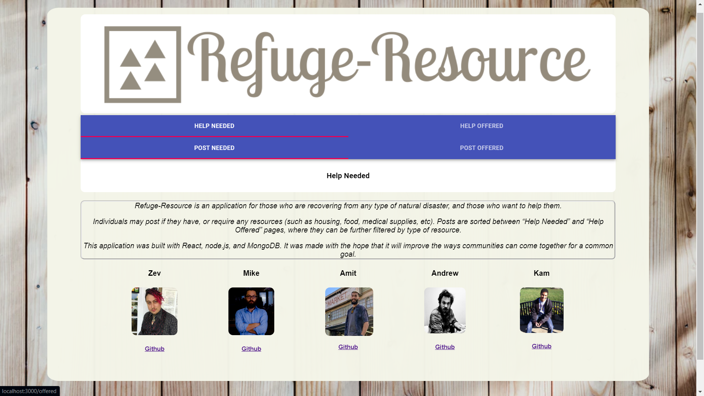

# Refuge-Resource

Refuge-Resource is an application for those who are recovering from any type of natural disaster, and those who want to help them.

Individuals may post if they have, or require any resources (such as housing, food, medical supplies, etc).  
Posts are sorted between “Help Needed” and “Help Offered” pages, where they can be further filtered by type of resource.  

This application was built with React,  node.js, and MongoDB.  
It was made with the hope that it will improve the ways communities can come together for a common goal. 

### Made by:
* Amit Gill
* Andrew Tocchi,
* Kameron Malone,
* Mike Brown,
* Zev Hoffman

### Made using:
* React.js,
* Material UI,
* Node.js,
* MongoDB

### Clip:

    
